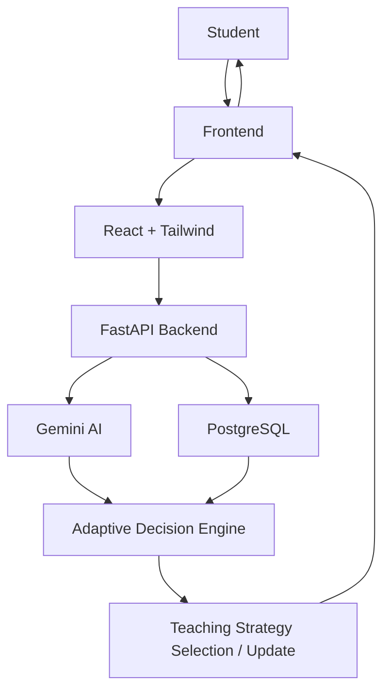

<div align="center">

# ADAPT
### *Stop studying harder. Start studying your way.*

</div>

---

## Table of Contents

* [Overview](#overview)
* [Problem Statement](#problem-statement)
* [Proposed Solution](#proposed-solution)
* [Learning DNA](#learning-dna)
* [Key Features](#key-features)
* [What Makes ADAPT Different](#what-makes-adapt-different)
* [How It Works](#how-it-works)
* [System Architecture](#system-architecture)
* [Technology Stack](#technology-stack)
* [Project Structure](#project-structure)
* [AI Architecture](#ai-architecture)
* [Adaptive Learning Example](#adaptive-learning-example)
* [Getting Started](#getting-started)
* [Environment Configuration](#environment-configuration)
* [Future Scope](#future-scope)
* [Impact](#impact)
* [Vision](#vision)
* [Team](#team)
* [License](#license)

---

## Overview

Students do not all learn in the same way.

Some understand concepts more effectively through examples, while others benefit from visual explanations, active recall, guided questioning, or explaining concepts in their own words.

ADAPT is designed around this difference.

Rather than treating every learner with the same teaching methodology, ADAPT observes how a student interacts with learning material and builds a dynamic **Learning DNA** representing the teaching approaches that appear to work best for that learner.

The system then uses this evolving representation to adapt future learning interactions.

### Core Idea

Traditional learning platforms primarily ask:

> **What should the student learn?**

ADAPT asks:

> **How should this student be taught?**

Its core learning loop is:

```text
DISCOVER
    ↓
TEACH
    ↓
OBSERVE
    ↓
ADAPT
    ↓
REMEMBER
    ↺
```

---

## Problem Statement

Students have access to more educational resources than ever, but access to content does not necessarily result in understanding.

A student may:

* Understand concepts better through examples
* Need visual explanations for abstract topics
* Learn more effectively through active recall than passive reading
* Need simpler explanations before increasing difficulty
* Understand a concept but struggle to recall it later
* Learn better when asked to explain a concept themselves

However, many learning systems primarily focus on delivering or recommending content rather than determining the teaching methodology that works for a particular learner.

This mismatch can contribute to:

* Frustration
* Disengagement
* Inefficient study sessions
* Shallow understanding
* Difficulty retaining concepts

The fundamental problem is therefore not only **what a student should learn**, but also **how that student should be taught**.

---

## Proposed Solution

ADAPT introduces a **personalized learning methodology**.

The platform builds a dynamic **Learning DNA** for each student by observing interactions with learning material.

Based on the evidence collected from those interactions, the system can adapt elements of the teaching process such as:

* Explanations
* Examples
* Questioning
* Difficulty
* Pacing
* Recall activities
* Teach-back interactions
* Teaching methodology

The goal is to create a continuous feedback loop in which the system learns from each interaction and uses that information to determine an appropriate next learning step.

### Solution Flow

```text
Student
   ↓
Learning Interaction
   ↓
Observe Response
   ↓
Evaluate Understanding
   ↓
Update Learning DNA
   ↓
Select Teaching Strategy
   ↓
Generate Next Interaction
   ↓
Student
   ↺
```

This creates an adaptive learning process instead of a fixed lesson sequence.

---

## Learning DNA

**Learning DNA** is a dynamic representation of the teaching approaches that appear to work best for a particular learner.

It can incorporate signals related to:

* Visual reasoning
* Example-based learning
* Active recall
* Teach-back
* Conceptual explanation
* Guided questioning
* Difficulty response
* Pacing
* Learning friction
* Recall performance

### Learning DNA Is Not a Permanent Label

Learning DNA is not intended to classify a student into a fixed personality or learning type.

Instead, it is an **evolving representation based on observed interactions**.

As more evidence becomes available, the representation can change.

```text
New Interaction
      ↓
Observe Evidence
      ↓
Update Learning DNA
      ↓
Change Teaching Strategy
      ↓
Observe Again
      ↺
```

---

## Key Features

### Learning DNA

Builds a dynamic learner profile based on observed learning behavior.

### Adaptive AI Tutor

Uses AI to generate explanations and learning interactions suited to the learner.

### Continuous Adaptation

Teaching strategies can change as new evidence about the learner becomes available.

### Active Recall

Uses questioning and retrieval rather than relying only on passive reading.

### Teach-Back

Encourages students to explain concepts in their own words.

### Difficulty Adaptation

Adjusts the level of challenge based on demonstrated understanding.

### Subject-Specific Learning

Learning interactions are generated according to the subject and concept being studied rather than relying entirely on generic questions.

### Learning Insights

Provides an evolving view of learning patterns and progress.

---

## What Makes ADAPT Different

ADAPT is designed around a different question from conventional learning and performance systems.

### Traditional Learning Systems

```text
What should I learn?
```

### Performance Systems

```text
How well am I doing?
```

### ADAPT

```text
How should I be taught?
```

The central differentiation is:

> **Personalized learning methodology.**

The objective is not only to personalize **what** the student learns, but also to personalize **how the content is taught**.

---

## How It Works

ADAPT follows a continuous adaptive learning cycle.

### 1. Discover

The system begins by observing the learner through diagnostic interactions.

These interactions provide evidence about how the student responds to different learning approaches.

### 2. Teach

The system presents learning material using an appropriate teaching approach.

This may involve explanations, examples, questions, or other supported interaction types.

### 3. Observe

The system observes the student's response to the learning interaction.

Signals can include demonstrated understanding, recall performance, difficulty response, and learning friction.

### 4. Adapt

The observed evidence is used to determine whether the current teaching approach should continue or change.

For example:

```text
Strong Understanding
        ↓
Increase Difficulty
```

or:

```text
Weak / Unclear Understanding
        ↓
Change Teaching Methodology
```

### 5. Remember

The interaction contributes to the learner's evolving state so that future teaching decisions can take previous evidence into account.

### End-to-End Flow

```text
Student
   ↓
Select Subject / Concept
   ↓
Diagnostic or Learning Interaction
   ↓
AI-Generated Explanation / Question
   ↓
Student Response
   ↓
Evaluate Understanding
   ↓
Update Learning DNA
   ↓
Select Next Teaching Strategy
   ↓
Generate Next Interaction
   ↓
Observe Again
   ↺
```

---

## System Architecture

The current architecture consists of a React and Tailwind frontend, a FastAPI backend, Gemini-based AI generation, PostgreSQL learning state, and an adaptive decision layer.



### Architecture Components

| Component                 | Role                                                                      |
| ------------------------- | ------------------------------------------------------------------------- |
| Student                   | Interacts with the learning system                                        |
| React + Tailwind Frontend | Provides the user-facing learning interface                               |
| FastAPI Backend           | Handles application and backend logic                                     |
| Gemini AI                 | Supports AI-powered learning interaction generation                       |
| PostgreSQL                | Stores learning state                                                     |
| Adaptive Decision Engine  | Uses observed learning information to support teaching-strategy decisions |
| Teaching Strategy Layer   | Determines how the next interaction should be delivered                   |

---

## Technology Stack

### Frontend

* React
* JavaScript
* HTML5
* CSS3
* Tailwind CSS

### Backend

* Python
* FastAPI
* Uvicorn
* Pydantic

### AI

* Google Gemini API
* Gemini-based content generation
* AI-driven adaptive teaching interactions

### Database

* PostgreSQL

### Development Tools

* Git
* GitHub
* VS Code
* Figma

---

## Project Structure

```text
ADAPT/
│
├── frontend/
│   ├── src/
│   │   ├── components/
│   │   ├── pages/
│   │   ├── hooks/
│   │   ├── services/
│   │   └── ...
│   │
│   ├── public/
│   ├── package.json
│   └── ...
│
├── backend/
│   ├── app/
│   │   ├── main.py
│   │   ├── database.py
│   │   ├── config.py
│   │   ├── models/
│   │   ├── schemas/
│   │   ├── routers/
│   │   └── services/
│   │
│   ├── requirements.txt
│   └── ...
│
├── .gitignore
├── README.md
└── ...
```

> The exact structure may vary depending on the current implementation.

---

## AI Architecture

ADAPT uses Gemini for AI-powered learning interactions.

The AI layer supports tasks such as:

* Generating explanations
* Creating subject-specific questions
* Providing examples
* Evaluating responses
* Generating follow-up questions
* Supporting teach-back interactions
* Adjusting difficulty
* Supporting adaptive teaching decisions

The architecture separates the AI generation layer from learner state so that interaction history can be considered when determining what should happen next.

### AI Interaction Flow

```text
Student Response
       ↓
AI Evaluation
       ↓
Understanding Signal
       ↓
Learner State
       ↓
Adaptive Decision
       ↓
Teaching Strategy
       ↓
Next AI Interaction
```

The AI layer therefore functions as part of a larger adaptive system rather than operating only as a conventional question-and-answer interface.

---

## Adaptive Learning Example

A simplified decision flow can be represented as:

```text
Student Response
       │
       ▼
Evaluate Understanding
       │
       ├───────────────────────┐
       │                       │
       ▼                       ▼
Strong                  Weak / Unclear
Understanding             Understanding
       │                       │
       ▼                       ▼
Increase                 Change Teaching
Difficulty                Methodology
       │                       │
       └───────────┬───────────┘
                   ▼
             Generate Next Step
                   │
                   ▼
              Observe Again
                   │
                   └───────────↺
```

This feedback loop allows the learning experience to change based on evidence rather than following one fixed lesson sequence.

---

## Getting Started

### Prerequisites

Before running ADAPT locally, make sure the following are installed:

* Node.js
* npm
* Python 3.10+
* PostgreSQL
* Git

You will also need a **Google Gemini API key**.

---

## Clone the Repository

Replace the repository placeholder with the actual GitHub repository URL.

```bash
git clone https://github.com/YOUR_USERNAME/YOUR_REPOSITORY.git
cd YOUR_REPOSITORY
```

---

## Backend Setup

Navigate to the backend directory:

```bash
cd backend
```

Create a Python virtual environment.

### Windows

```bash
python -m venv venv
```

Activate the environment:

```bash
venv\Scripts\activate
```

### macOS / Linux

```bash
python3 -m venv venv
source venv/bin/activate
```

Install the backend dependencies:

```bash
pip install -r requirements.txt
```

---

## Start the Backend

From the `backend` directory:

```bash
uvicorn app.main:app --reload
```

The backend will typically run at:

```text
http://127.0.0.1:8000
```

FastAPI's interactive API documentation will typically be available at:

```text
http://127.0.0.1:8000/docs
```

---

## Frontend Setup

Open another terminal and navigate to the frontend directory:

```bash
cd frontend
```

Install the frontend dependencies:

```bash
npm install
```

Start the development server:

```bash
npm run dev
```

The frontend will typically be available at:

```text
http://localhost:5173
```

---

## Environment Configuration

If the frontend requires a backend API URL, configure it using a frontend environment file.

Example:

```env
VITE_API_URL=http://127.0.0.1:8000
```

The Gemini API key should not be exposed in frontend source code.

Store secret credentials in the appropriate backend environment configuration instead.

---

## Future Scope

The following directions represent potential future development rather than claims about the current implementation.

### Long-Term Learner Modeling

Develop more sophisticated representations of learner state over longer periods of interaction.

### Advanced Learning-State Estimation

Improve how the system estimates a student's current understanding and learning behavior.

### Multimodal Learning

Expand adaptive teaching beyond the currently supported interaction methods.

### Voice-Based Tutoring

Explore voice-based learning interactions.

### Personalized Revision Schedules

Use learner-state information to support individualized revision planning.

### Spaced Repetition

Introduce spaced-repetition strategies for improving long-term recall.

### Teacher Dashboards

Provide educators with visibility into learner progress and learning patterns.

### Institutional Analytics

Explore analytics capabilities for educational institutions.

### Behavioral Learning Signals

Investigate additional learning-related signals that could contribute to learner modeling.

### Accessibility-Focused Teaching

Develop teaching strategies that better accommodate different accessibility requirements.

### Educational Platform Integration

Explore integration with existing educational platforms.

### Additional Subjects and Curricula

Extend support to additional subjects and educational curricula.

---

## Limitations

ADAPT's Learning DNA is an evolving representation based on observed interactions.

It should therefore not be interpreted as a permanent classification of a learner or as a definitive measurement of how a person learns.

The effectiveness of adaptive teaching decisions depends on the quality and quantity of interaction evidence available to the system.

The current project is also described as an MVP and hackathon-oriented implementation, so the future-scope capabilities listed above should not be interpreted as currently implemented functionality.

---

## Impact

ADAPT aims to make learning more responsive to individual students.

Instead of expecting every learner to adapt to the same teaching methodology, the system is designed to continuously learn from interactions and adjust its approach.

The long-term objective is:

> **A learning system that becomes better at teaching you the more you interact with it.**

---

## Vision

Education does not need one perfect way to teach everyone.

It needs systems capable of discovering what works for each learner.

ADAPT is built around the idea that personalization should extend beyond content recommendations and performance tracking to the **methodology of teaching itself**.

```text
DISCOVER
    ↓
TEACH
    ↓
OBSERVE
    ↓
ADAPT
    ↓
REMEMBER
```

---

## Team

Built for **HACK DEVENGERS 2.0**.

---

## License

This project is currently intended for educational and hackathon purposes.

No open-source license is currently specified.

If the project is intended for public reuse, an appropriate open-source license can be added.

---

## ADAPT

### Stop studying harder.

### Start studying your way.

> **ADAPT doesn't just learn what you know. It learns how to teach you.**
